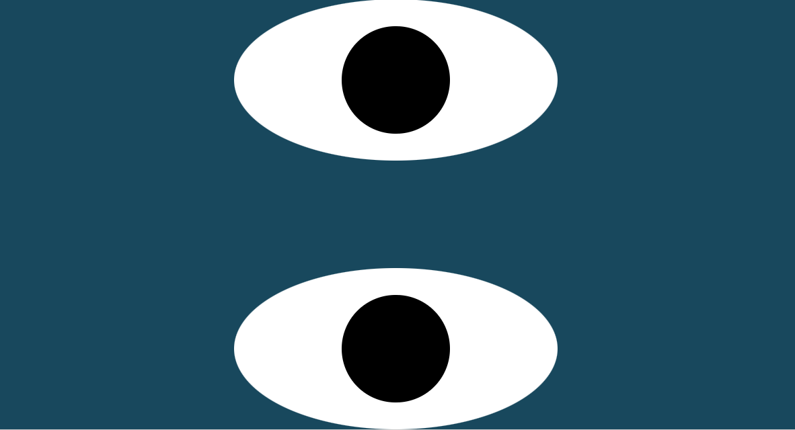

# Eyes Exercise

## Description

In this exercise we create a web page with 2 eyes on it. The eyes follow your mouse so if your mouse is to the left of the eyes, then both eyes will look left towards the direction of the mouse. Both eyes will move in the same direction as your mouse as your mouse moves.

## How to Run

Save all of the files in this repository to a folder on your computer. If you need to make any changes, you can do so using an editor like vs code. Open a blank browser and drag the index over to it. 

## Licenses

MIT License
